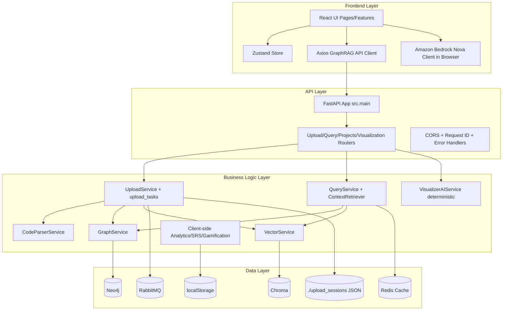
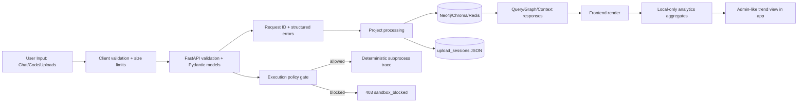
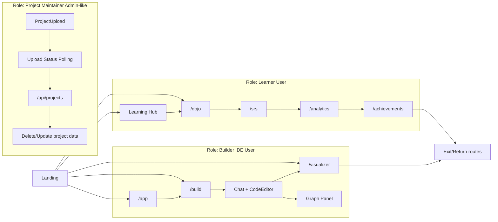
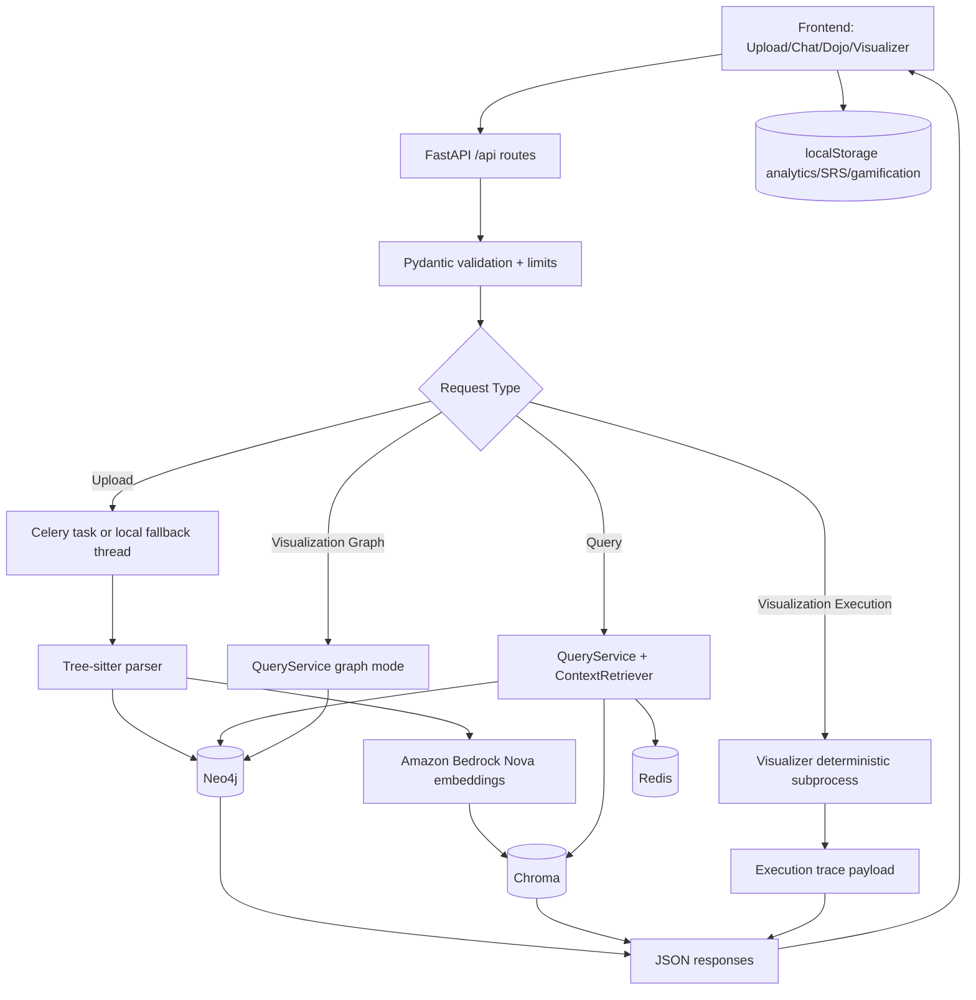
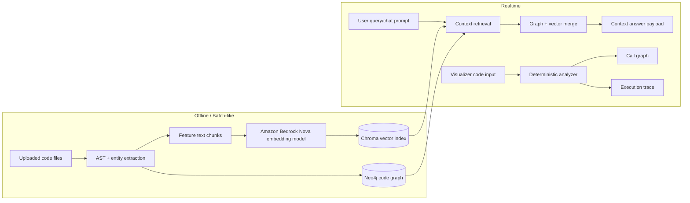
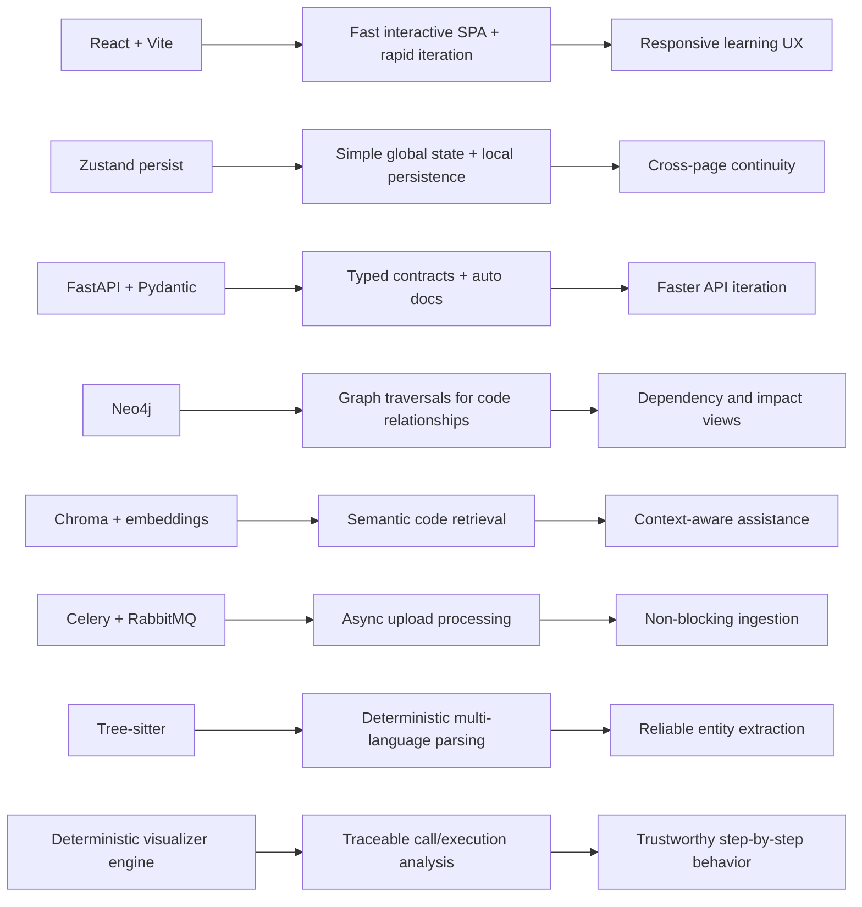

# Cure-Quest

An AI-assisted multi-agent prototype for medication-aware chronic care, document ingestion, human-in-the-loop (HITL) review, and clinician handoffs.

This README is a concise reference: tech stack, architecture, quick start, and validation pointers. Detailed design and runbooks live under `docs/`.

Table of contents
- Project overview
- Tech Stack
- Architecture (diagrams)
- Privacy & Trust
- Role flows
- Data flow
- AI / ML pipeline
- Quick start
- Validation checklist
- Appendix

## Tech Stack

### Frontend
- React ^18.3.1 (lockfile resolved 18.3.1)
- Vite ^5.1.0 (lockfile resolved 5.4.21)
- TypeScript ^5.3.3
- Tailwind CSS ^3.4.1 (lockfile resolved 3.4.19)
- Framer Motion ^12.29.0
- GSAP ^3.14.2 + @gsap/react
- Zustand ^4.5.0 (lockfile resolved 4.5.7)
- Monaco Editor, React Flow, DnD Kit
- Axios for API transport
- AWS Bedrock runtime client path for direct frontend chat/card generation

### Backend
- FastAPI 0.104.1
- Uvicorn 0.24.0
- Pydantic 2.5.0, pydantic-settings 2.1.0
- Neo4j 5.14.1
- ChromaDB 0.4.15
- Redis 5.0.1
- Celery 5.3.4 + RabbitMQ (broker)
- Tree-sitter parsers (Python/JS/TS/Java)
- Bedrock/Nova embedding service path (provider-backed embeddings)

### Infra & deployment clues
- Docker / Docker Compose (see `backend/docker-compose.yml`, `backend/docker-compose.prod.yml`)
- Vercel config (`frontend/vercel.json`)
- Netlify config (`frontend/netlify.toml`)

Version verification sources: `frontend/package.json`, `frontend/package-lock.json`, and `backend/requirements.txt` + compose/runtime config. Items with range vs lock mismatches are flagged in the VALIDATION CHECKLIST.

## Architecture

1) Layered System Architecture



Caption: Layered architecture from UI to storage with queue/cache boundaries.

2) Privacy & Trust Layer (detailed)



Trust controls: request IDs, strict Pydantic payloads, environment-driven execution gate, and local vs server persistence boundaries. There is no built-in consent audit or cryptographic ZKP module — those would be operational extensions.

3) Application Role Flows



Caption: Learner, Builder, and Maintainer journeys exposed as route surfaces.

4) Data Flow Diagram



Caption: Upload parsing → graph + embeddings → query/visualizer responses. Frontend-only analytics persist locally.

5) AI / ML Pipeline Diagram



Caption: Offline embedding/index build and realtime retrieval + deterministic visualizer analysis.

6) Why-this-stack



Caption: Technology → capability → outcome mapping.

## Quick Start (condensed)

Prerequisites: Python 3.12+, Node.js 18+, Google Cloud project with required APIs.

Backend (dev):

```powershell
python -m venv .venv
.venv\Scripts\Activate.ps1
pip install -e .[dev]
Copy-Item .env.example .env
# edit .env with keys (GOOGLE_*, DATABASE_URL, etc.)
uvicorn cure_quest.app:app --reload
```

Frontend (dev):

```powershell
cd frontend
npm install
npm run dev
```

Database / seed hints:
- Use AlloyDB or Postgres for full features. For local tests, toggle `DATABASE_URL` to sqlite.
- If using AlloyDB Auth Proxy, run `python scripts/print_alloydb_proxy_command.py` and start the proxy before migrations/seeding.

## Validation Checklist
- [ ] `.env` has `GOOGLE_CLOUD_PROJECT`, model keys, and `DATABASE_URL`.
- [ ] Run `python -m cure_quest.scripts.seed` to seed demo data.
- [ ] `uvicorn cure_quest.app:app --reload` serves `/docs` and `/health`.
- [ ] ADK agent launches from `adk_agents/` and can reach the MCP server.
- [ ] Run `pytest` to validate core backend tests.

## Appendix & Next steps
- Diagrams and long-form design: `docs/` folder.
- Deployment notes: `cloudbuild.yaml`, `cloudbuild.frontend.yaml`, and `cloudrun.env.example`.
- To export mermaid diagrams locally:

```bash
npx @mermaid-js/mermaid-cli -i diagram.mmd -o diagram.svg
```

If you'd like, I can:
- create a smaller README summary for the GitHub project page,
- add badges (build/test/coverage), or
- split this README into `README.md` + `CONTRIBUTING.md` + `DEPLOY.md`.

---
Updated README to match the requested structure and diagrams.
