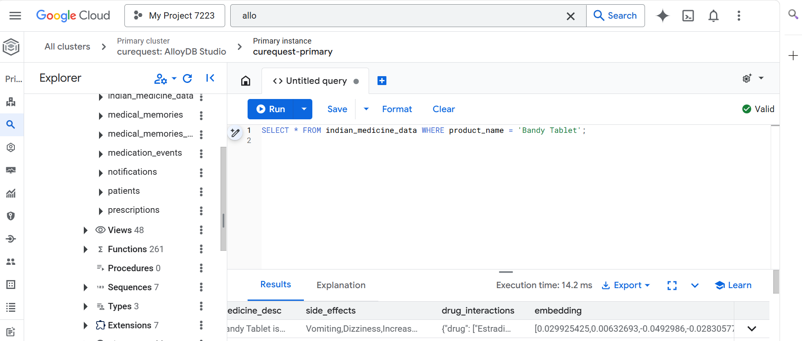
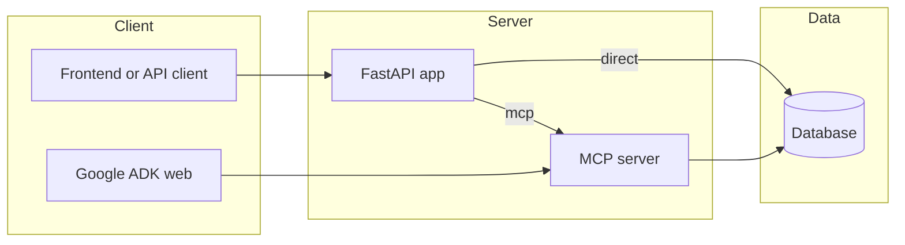

# Cure-Quest

**An AI-powered multi-agent healthcare platform** that provides personalized chronic care management through intelligent conversational AI, real-time medication safety analysis, and transparent human-in-the-loop doctor handoffs.

Cloud Run API endpoint (for testing):
https://cure-quest-api-315569715049.us-central1.run.app

## Documentation Plan
- Source-of-truth docs: [Connection Architecture](docs/CONNECTION_ARCHITECTURE.md), [Plan 1](docs/PLAN_1_REPO_STATE_AND_MISSING_ENDPOINTS.md), [Plan 2](docs/PLAN_2_IMPLEMENTATION_CHANGE_MAP.md), [Plan 3](docs/PLAN_3_INFORMATION_NEEDED.md), [Wiring Checklist](docs/WIRING_CHECKLIST.md).
- First 3 files/folders to inspect: `docs/CONNECTION_ARCHITECTURE.md`, `docs/PLAN_1_REPO_STATE_AND_MISSING_ENDPOINTS.md`, `docs/WIRING_CHECKLIST.md`.
- First diagram to generate: **Connection Architecture Map** (FastAPI + ADK + MCP + DB).
- Estimated pass order: `1) env + bootstrap scripts, 2) backend routes/agents/adapters/MCP, 3) frontend screens/components, 4) integrations + deployment`.

## Table of Contents
- [Project Overview](#project-overview)
- [Demo Media](#demo-media)
- [Quick Start](#quick-start)
- [Tech Stack](#tech-stack)
- [Architecture](#architecture)
- [Directory Structure](#directory-structure)
- [Component Index](#component-index)
- [API Contracts](#api-contracts)
- [Data Flow & State Management](#data-flow--state-management)
- [AI/ML Section](#aiml-section)
- [Styling & Theming](#styling--theming)
- [Testing](#testing)
- [Build & Deployment](#build--deployment)
- [Troubleshooting](#troubleshooting)
- [Contributing](#contributing)
- [Validation & Manifest](#validation--manifest)
- [VALIDATION CHECKLIST](#validation-checklist)
- [Appendix](#appendix)

## Project Overview
Cure-Quest coordinates care across multiple dimensions:
- **Voice/Chat AI** for patient questions and follow-up guidance.
- **Document upload** for prescription scans and medical artifacts.
- **HITL review** to produce doctor-ready summaries.
- **Medication reminders** and care notifications.
- **Google Workspace integration** for Drive, Calendar, Gmail, Speech, and Maps.

### Demo Story — Shreesha's Care Journey
Shreesha is a 22-year-old patient managing two chronic conditions simultaneously:
- **Atopic Eczema** (moderate to severe) — recurring flares on forearms and neck, managed with topical Clobetasol Propionate.
- **Focal Epilepsy** — diagnosed at age 19, currently controlled with Levetiracetam 500 mg twice daily.

The demo walks through drug interaction questions, document uploads, doctor handoff reports,
medication reminders, and Gmail-based care summaries.

## Demo Media
- [Working ADK demo video (mp4)](assets/Working_adk_demo.mp4)


.png)


## Quick Start
### Prerequisites
- Python 3.12+
- Node.js 18+
- Google Cloud project with APIs enabled (Drive, Calendar, Gmail, Speech, Maps)
- AlloyDB instance (or use SQLite for local dev)

### 1) Backend setup
```powershell
# Create virtual environment
python -m venv .venv
.venv\Scripts\Activate.ps1

# Install dependencies
pip install -e .[dev]

# Copy and configure environment
Copy-Item .env.example .env
# Edit .env with your API keys and database URL
```

### 2) Database setup
```powershell
# If using AlloyDB Auth Proxy:
python scripts/print_alloydb_proxy_command.py
# Start the proxy in a separate terminal, then:

# Seed the demo patient and workspace data
$env:PYTHONPATH="src"
python -m cure_quest.scripts.seed

# Setup vector storage (optional)
python scripts/setup_alloydb_vector.py
```

### 3) Frontend setup
```powershell
cd frontend
npm install

# Copy and configure environment
Copy-Item .env.example .env
# Set VITE_GOOGLE_CLIENT_ID for Google Sign-In

npm run dev
```

### 4) Run the API
```powershell
uvicorn cure_quest.app:app --reload
```

Visit `http://localhost:3000` for the UI, or `http://localhost:8000/docs` for the API docs.

### Cloud Run
The backend API is prepared for Cloud Run deployment with `Dockerfile`, `.dockerignore`, and
`cloudbuild.yaml`. See `docs/CLOUD_RUN_DEPLOYMENT.md` for the full steps.

## Tech Stack
| Layer | Technology |
|-------|-----------|
| **Frontend** | React 19, Vite, Tailwind CSS 4, Motion (Framer), Lucide Icons |
| **Backend** | Python 3.12+, FastAPI, SQLAlchemy 2.0, Uvicorn |
| **AI Models** | Gemini 3.1 Flash (conversation), MedGemma (clinical), MedSigLIP (vision) |
| **Database** | Google Cloud AlloyDB (PostgreSQL-compatible) |
| **Google APIs** | Drive, Calendar, Gmail, Speech-to-Text, Text-to-Speech, Maps |
| **Integrations** | Asana (ticketing), OpenFDA (drug labels), BigQuery (analytics) |
| **Design System** | "Digital Sanctuary" — Sage/Terracotta/Sand palette, glassmorphism |

## Architecture
Core runtime surfaces from [Connection Architecture](docs/CONNECTION_ARCHITECTURE.md):
- FastAPI application (`cure_quest.app:app`)
- Google ADK web agent (`adk_agents/cure_quest_agent`)
- Local MCP server (`python -m cure_quest.mcp.server`)
- Shared database layer (SQLite locally or AlloyDB in production)



For detailed connection wiring and recommended sequence, see:
- [Connection Architecture](docs/CONNECTION_ARCHITECTURE.md)
- [Wiring Checklist](docs/WIRING_CHECKLIST.md)

## Directory Structure
```text
frontend/                 React UI (Vite + Tailwind)
  src/
    screens/              Dashboard, CareMaze, MedicationHub, HITL, History, Login
    components/           Layout, VoiceAssistant, ChatAssistant, UI primitives
    hooks/                useWorkspace data hook
    lib/                  API client functions

src/cure_quest/
  api/                    FastAPI routes and Pydantic models
  agents/                 Orchestrator, HITL, Communications, Recipe, Vision
  adapters/               Google APIs, Asana, OpenFDA
  db/                     SQLAlchemy models and session management
  services/               Brain service, model routing, image classification
  mcp/                    Model Context Protocol server
  adk/                    Google ADK agent definition

adk_agents/               ADK web agent package
scripts/                  Setup and seed utilities
docs/                     Architecture and planning documentation
assets/                   Demo images and video
```

## Component Index
### Backend (src/cure_quest)
- `api/` — FastAPI route handlers and request/response models.
- `agents/` — Orchestrator + domain agents (HITL, Communications, Vision, Recipe).
- `adapters/` — Integrations (Google APIs, Asana, OpenFDA).
- `mcp/` — Local MCP server and tool registry.
- `db/` — SQLAlchemy schema + bootstrap.

### Frontend (frontend/src)
- `screens/` — Route-level pages (Dashboard, Care Maze, Medication Hub, HITL, History).
- `components/` — Shared UI and assistant components.
- `hooks/` — Workspace data and view hooks.
- `lib/` — API and workspace client helpers.

See [Plan 1](docs/PLAN_1_REPO_STATE_AND_MISSING_ENDPOINTS.md) for a detailed audit of missing pieces.

## API Contracts
Full routes live in `src/cure_quest/api/routes.py`.

### Patient & Auth
| Method | Endpoint | Description |
|--------|----------|-------------|
| `POST` | `/auth/google` | Exchange Google OAuth code for tokens |
| `GET` | `/auth/google/status/{patient_id}` | Check connected Google services |
| `POST` | `/patient/intake` | Register a new patient |
| `POST` | `/patient/reminders` | Save a medication reminder |
| `GET` | `/patient/{patient_id}/reminders` | List saved reminders |

### Orchestration
| Method | Endpoint | Description |
|--------|----------|-------------|
| `GET` | `/orchestration/check-in/{patient_id}` | Daily check-in with routine tasks |
| `POST` | `/orchestration/hitl-report` | Generate HITL doctor report |
| `POST` | `/orchestration/hitl-comprehension` | AI-powered patient comprehension |
| `POST` | `/orchestration/diet-support` | Medication-aware diet guidance |
| `POST` | `/orchestration/voice-route` | Voice conversation pipeline |
| `GET` | `/orchestration/manifest/{patient_id}` | Agent & model assignment manifest |

### Documents & Medical
| Method | Endpoint | Description |
|--------|----------|-------------|
| `POST` | `/documents/upload-file` | Upload document (multipart) |
| `POST` | `/drug/label` | OpenFDA drug label lookup |
| `POST` | `/patient/check-alternatives` | Check medication alternatives |
| `POST` | `/medical-models/medgemma` | Run MedGemma inference |

### Google Workspace
| Method | Endpoint | Description |
|--------|----------|-------------|
| `POST` | `/calendar/events` | Create calendar events |
| `GET` | `/gmail/{patient_id}/health-emails` | List health-related emails |
| `POST` | `/gmail/send-care-summary` | Email care summary to doctor |

## Data Flow & State Management
- **Direct mode**: `API -> Brain service -> SQLAlchemy -> DB` (`BRAIN_GATEWAY_MODE=direct`).
- **MCP mode**: `API or ADK -> MCP -> Brain tools -> DB` (`BRAIN_GATEWAY_MODE=mcp`).
- **Frontend state** lives in React component state and workspace hooks, while durable patient state is stored in the database.

See [Connection Architecture](docs/CONNECTION_ARCHITECTURE.md) for the full connection map.

## AI/ML Section
- Primary conversational model: Gemini 3.1 Flash.
- Vision classification: MedSigLIP for prescription/symptom imagery.
- Clinical reasoning path: MedGemma (runtime route: `/medical-models/medgemma`).
- Embedding and memory workstreams are tracked in the planning documents.

## Styling & Theming
The UI follows the **Digital Sanctuary** design system (sage/terracotta/sand palette, glassmorphism, organic editorial layout). See [DESIGN.md](DESIGN.md) for detailed tokens and layout guidance.

## Testing
```powershell
# Backend tests
pytest

# Frontend checks
cd frontend
npm run lint
npm run build
```

## Build & Deployment
- Backend container: `Dockerfile` + `cloudbuild.yaml`
- Frontend container: `frontend.Dockerfile` + `cloudbuild.frontend.yaml`
- Cloud Run environment: `cloudrun.env.example`

See [CLOUD_RUN_DEPLOYMENT](docs/CLOUD_RUN_DEPLOYMENT.md) for deploy steps and environment wiring.

## Troubleshooting
- Validate DB connectivity with `python scripts/test_database_connection.py`.
- Validate MCP tool transport with `python scripts/test_mcp_connection.py`.
- If ADK web shows extra packages, launch from `adk_agents/` (see [Wiring Checklist](docs/WIRING_CHECKLIST.md)).
- Toggle `BRAIN_GATEWAY_MODE` between `direct` and `mcp` to isolate DB vs tool-transport issues.

## Contributing
- Review the source-of-truth docs before making architectural changes.
- Keep planning updates in `docs/` and link back here if structure shifts.
- Open a PR describing scope, risk, and validation steps.

## Validation & Manifest
Core connection sequence from [Connection Architecture](docs/CONNECTION_ARCHITECTURE.md):
1. Database connection
2. FastAPI → database
3. MCP server → database
4. ADK agent → MCP server
5. ADK web UI → ADK agent
6. External integrations one by one

## VALIDATION CHECKLIST
- [ ] `.env` configured with required local values (see [Wiring Checklist](docs/WIRING_CHECKLIST.md)).
- [ ] `python scripts/test_database_connection.py` passes.
- [ ] `python -m cure_quest.scripts.seed` completes successfully.
- [ ] `python scripts/test_mcp_connection.py` passes.
- [ ] `uvicorn cure_quest.app:app --reload` serves `/health`.
- [ ] ADK web launches from `adk_agents/` and can invoke MCP tools.
- [ ] Switch `BRAIN_GATEWAY_MODE=mcp` and re-run API flows.
- [ ] If moving to AlloyDB, update `DATABASE_URL` and re-run all smoke tests.

## Appendix
- [Architecture and Design](docs/ARCHITECTURE_AND_DESIGN.md)
- [Connection Architecture](docs/CONNECTION_ARCHITECTURE.md)
- [Plan 1: Repo State and Missing Endpoints](docs/PLAN_1_REPO_STATE_AND_MISSING_ENDPOINTS.md)
- [Plan 2: Implementation Change Map](docs/PLAN_2_IMPLEMENTATION_CHANGE_MAP.md)
- [Plan 3: Information Needed](docs/PLAN_3_INFORMATION_NEEDED.md)
- [Wiring Checklist](docs/WIRING_CHECKLIST.md)
- [Design System Specification](DESIGN.md)
- [Implementation Metrics Transcript](docs/CURE_QUEST_IMPLEMENTATION_METRICS_TRANSCRIPT.md)
