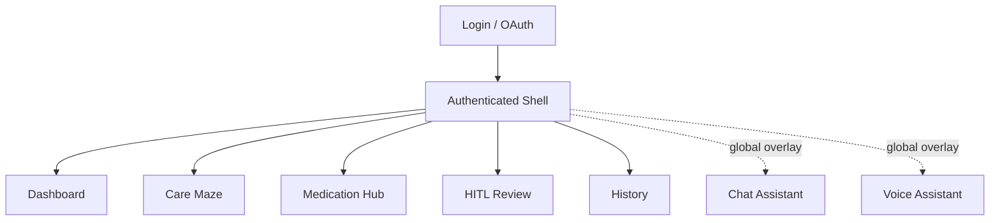
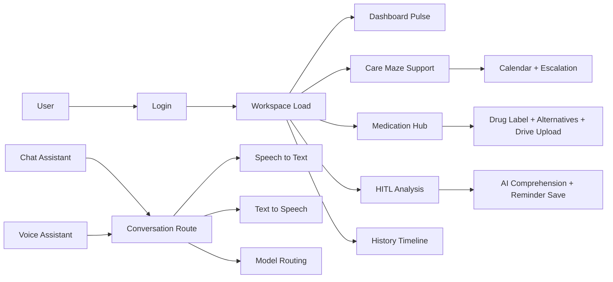

# Cure-Quest Frontend Wireframe Spec (design2)

Purpose:
This file is a wireframe and mock-diagram generation spec for Stitch (or any design/code image model). It is grounded in the current frontend implementation and focused on generating snapshots of every user-facing page and major UI state.

Scope:
- Login and authenticated app shell
- Dashboard
- Care Maze
- Medication Hub
- HITL Review
- History Timeline
- Global overlays: Chat Assistant and Voice Assistant

Out of scope:
- Legacy or unused screens not mounted by the current App flow
- Backend implementation details

## 1. Source of Truth for Active Pages

Current routed page flow in app:
1. LoginScreen
2. DashboardScreen
3. CareMazeScreen
4. MedicationHubScreen
5. HITLScreen
6. HistoryScreen

Global overlays available on all authenticated pages:
- ChatAssistant (floating panel)
- VoiceAssistant (floating FAB + response toast)

Shared shell on authenticated pages:
- Header with brand, patient context, refresh, bell
- Left desktop nav rail / bottom mobile nav
- Soft glass + nurture card visual language

## 2. Experience Goals

- Calm, premium healthcare workspace
- Highly scannable card-based hierarchy
- Traceable care flow: input -> AI support -> escalation -> history
- Dual interaction model: page workflow + always-available assistants

## 3. Information Architecture



## 4. Feature Wiring Diagram



## 5. Shared Visual and Layout Tokens (for wireframe generation)

Use these style constraints in generated mocks:
- Warm-neutral background with soft radial gradients
- Large rounded cards (2rem feel)
- Glass top surfaces for header/nav shells
- Serif headlines + clean sans body copy
- No hard 1px section dividers; separate by tonal layers and spacing
- Floating action controls anchored bottom-right (voice/chat)

Primary layout regions (authenticated):
1. Global header
2. Left nav rail (desktop) or bottom nav (mobile)
3. Main content area
4. Floating overlay zone (chat/voice)

## 6. Page-by-Page Wireframe Snapshots

Each section has:
- Wireframe intent
- Components list
- HTML skeleton for Stitch/code-to-wireframe
- States to generate

---

## 6.1 Login Page

Wireframe intent:
Single-focus onboarding with Google sign-in, patient preview, and service connection badges.

Key components:
- Brand logo block
- Login card
- Patient identity preview row
- Google sign-in CTA
- Dev mode fallback CTA
- Error message area
- Optional connected service badges after success

HTML snapshot:
```html
<section class="login-page">
  <div class="ambient-background"></div>

  <main class="login-shell">
    <header class="brand-block">
      <div class="brand-mark">CQ</div>
      <h1>Cure-Quest</h1>
      <p>Your Digital Sanctuary</p>
    </header>

    <article class="login-card">
      <div class="patient-preview">
        <div class="avatar"></div>
        <div>
          <h2>Shreesha</h2>
          <p>Patient ID: 2</p>
        </div>
      </div>

      <p class="support-copy">Sign in with Google to connect Drive, Calendar, and Gmail.</p>

      <button class="primary-google-cta">Sign in with Google</button>
      <button class="secondary-dev-cta">Skip (Dev mode)</button>

      <div class="error-banner">Authentication failed message</div>
      <div class="connected-badges">Drive | Calendar | Gmail</div>
    </article>

    <footer class="compliance-note">Protected by Google Cloud • HIPAA Compliant</footer>
  </main>
</section>
```

States to render:
- default
- loading/auth in progress
- success (connected badges visible)
- error

---

## 6.2 Authenticated App Shell

Wireframe intent:
Persistent framework around all pages with clear orientation and low cognitive load.

Key components:
- Top header with logo, patient context, refresh, notifications
- Left nav (desktop): Dashboard, Care Maze, Meds, HITL, History
- Bottom nav (mobile) with active state
- Main content slot
- Floating overlay area for assistants

HTML snapshot:
```html
<div class="app-shell">
  <header class="top-header">
    <div class="brand-context">
      <div class="brand-icon"></div>
      <div>
        <h1>Cure-Quest</h1>
        <p>Digital sanctuary for [Patient Name]</p>
      </div>
    </div>
    <div class="header-actions">
      <button>Refresh</button>
      <button>Notifications</button>
    </div>
  </header>

  <div class="shell-grid">
    <aside class="nav-rail desktop-only">
      <nav>
        <button class="active">Dashboard</button>
        <button>Care Maze</button>
        <button>Meds</button>
        <button>HITL</button>
        <button>History</button>
      </nav>
      <section class="support-card">Quietly coordinated care summary</section>
    </aside>

    <main class="screen-slot">[Active Screen Content]</main>
  </div>

  <nav class="bottom-nav mobile-only">...</nav>

  <section class="overlay-zone">
    <div class="chat-assistant"></div>
    <div class="voice-assistant"></div>
  </section>
</div>
```

States to render:
- desktop layout
- mobile layout

---

## 6.3 Dashboard

Wireframe intent:
At-a-glance care pulse with quick status metrics and latest handoff visibility.

Key components:
- Hero intro with patient name + check-in message
- Sanctuary pulse hero card with 3 KPIs (conditions, routines, cases)
- Latest doctor handoff panel
- Daily rhythm list
- Model choreography list
- Three quick context cards (conditions, latest medication, language)

HTML snapshot:
```html
<section class="dashboard-screen">
  <header class="section-intro">
    <p>Dashboard</p>
    <h2>Good evening, [First Name]</h2>
    <p>[Check-in message]</p>
  </header>

  <div class="row row-hero">
    <article class="pulse-card">
      <h3>Care is coordinated and visible</h3>
      <div class="kpi-grid">
        <div>Conditions: 2</div>
        <div>Routines: 4</div>
        <div>Doctor cases: 1</div>
      </div>
    </article>

    <article class="handoff-card">
      <h3>Doctor-ready context</h3>
      <p>Status pill</p>
      <p>Latest escalation summary</p>
      <a>Asana</a><a>Calendar</a><a>Drive</a>
    </article>
  </div>

  <div class="row row-middle">
    <article class="routine-list">Routine blossoms list</article>
    <article class="model-list">Agent model choreography list</article>
  </div>

  <div class="row row-bottom">
    <article>Chronic context pills</article>
    <article>Latest medication card</article>
    <article>Response language card</article>
  </div>
</section>
```

States to render:
- loaded
- loading state card
- error state card
- empty workspace fallback

---

## 6.4 Care Maze

Wireframe intent:
Route planner that combines medication, location, support suggestions, and escalation actions.

Key components:
- Inputs: medication + location
- Action buttons: map route, create follow-up, send doctor handoff
- Feedback banner
- Latest handoff panel with links
- Conditional support result area:
  - diet support card
  - nearby pharmacy cards
- Bottom capability cards (calendar-ready, condition-aware, MCP-compatible)

HTML snapshot:
```html
<section class="care-maze-screen">
  <header class="section-intro">
    <p>Care Maze</p>
    <h2>Navigate the gaps before they become friction</h2>
  </header>

  <div class="row row-top">
    <article class="route-planner-card">
      <label>Medication focus <input value="Metformin" /></label>
      <label>Pharmacy location <input value="Koramangala Bangalore" /></label>
      <div class="actions">
        <button>Map support route</button>
        <button>Create follow-up</button>
        <button>Send doctor handoff</button>
      </div>
      <div class="feedback">Operation feedback text</div>
    </article>

    <article class="latest-handoff-card">
      <h3>Latest care handoff</h3>
      <p>Status pill + summary + links</p>
    </article>
  </div>

  <div class="row row-results">
    <article class="diet-support-card">Meal rules list</article>
    <article class="pharmacy-list-card">Nearby pharmacy items</article>
  </div>

  <div class="row row-footer-cards">
    <article>Calendar-ready</article>
    <article>Condition-aware</article>
    <article>MCP-compatible</article>
  </div>
</section>
```

States to render:
- default before run
- mapping in progress
- support results loaded
- no pharmacies found
- escalation sent feedback

---

## 6.5 Medication Hub

Wireframe intent:
Medication safety workspace combining alternatives, regulatory labels, and document upload intelligence.

Key components:
- Medication query console
- Alternative check + openFDA lookup actions
- Latest prescription card
- Alternative result list with escalation hint
- Drag/drop upload area
- Expected route + model chips
- Upload progress + success/error states
- openFDA JSON snapshot panel

HTML snapshot:
```html
<section class="medication-hub-screen">
  <header class="section-intro">
    <p>Medication Hub</p>
    <h2>Resolve medication friction before it reaches the patient</h2>
  </header>

  <div class="row row-query">
    <article class="query-card">
      <label>Medication name <input value="..." /></label>
      <button>Check alternatives</button>
      <button>Fetch openFDA label</button>
      <div class="feedback"></div>
    </article>

    <article class="latest-prescription-card">
      <h3>Last prescription</h3>
      <p>status pill</p>
      <p>medication + instructions</p>
      <a>Open Drive document</a>
    </article>
  </div>

  <div class="row row-analysis">
    <article class="alternative-results-card">candidate medication cards</article>

    <article class="upload-card">
      <div class="drop-zone">Drop file or click</div>
      <div class="route-preview">expected route + model pills</div>
      <button>Upload to Google Drive</button>
      <div class="upload-success">file + category + drive link</div>
      <div class="upload-error">error message</div>
      <div class="trigger-memory">routing guidance note</div>
    </article>
  </div>

  <article class="openfda-snapshot-card">
    <h3>openFDA snapshot</h3>
    <pre>{ JSON payload }</pre>
  </article>
</section>
```

States to render:
- no alternative run
- alternative results loaded
- upload idle
- drag-over upload zone
- upload in progress
- upload success
- upload error
- label lookup loaded

---

## 6.6 HITL Review

Wireframe intent:
Clinician handoff intelligence page with AI comprehension and reminder management.

Key components:
- Generate HITL report CTA
- Report error banner
- Left column (report): patient card, conditions, medications with duration, AI analysis
- Right column (operations): reminder list + add reminder form + info card

HTML snapshot:
```html
<section class="hitl-screen">
  <header class="section-intro">
    <p>HITL Review</p>
    <h2>Human-in-the-loop patient comprehension</h2>
  </header>

  <div class="actions">
    <button>Generate HITL Report</button>
  </div>

  <div class="error-banner">report error text</div>

  <div class="main-grid">
    <div class="left-report-column">
      <article class="patient-profile-card">name, dob, summary</article>
      <article class="conditions-card">condition rows with type/status</article>
      <article class="medications-card">dosage, days on med, confidence</article>
      <article class="ai-analysis-card">long-form reasoning + recommended actions</article>
    </div>

    <aside class="right-reminders-column">
      <article class="reminder-card">
        <button>Add reminder (+)</button>
        <form class="reminder-form">medication + time + save</form>
        <div class="reminder-list">active reminders</div>
      </article>

      <article class="hitl-info-card">What HITL means and why</article>
    </aside>
  </div>
</section>
```

States to render:
- no report generated
- report generating
- report generated
- reminder form closed/open
- reminders empty/list loaded

---

## 6.7 History Timeline

Wireframe intent:
Unified longitudinal timeline merging escalations, prescriptions, communications, and memories.

Key components:
- Timeline vertical rail
- Event blossom markers with tone by event type
- Event cards with pill type, timestamp, summary, optional link

HTML snapshot:
```html
<section class="history-screen">
  <header class="section-intro">
    <p>History</p>
    <h2>Clinical context becomes a story</h2>
  </header>

  <div class="timeline-layout">
    <div class="timeline-rail"></div>

    <article class="timeline-item doctor-case">
      <div class="marker"></div>
      <div class="item-card">
        <span class="pill">Doctor Case</span>
        <h3>case title</h3>
        <time>timestamp</time>
        <p>summary</p>
        <a>Open attachment</a>
      </div>
    </article>

    <article class="timeline-item prescription">...</article>
    <article class="timeline-item communication">...</article>
    <article class="timeline-item memory">...</article>
  </div>
</section>
```

States to render:
- populated timeline
- empty timeline
- loading
- error

---

## 6.8 Global Overlay: Chat Assistant

Wireframe intent:
Context-preserving chat drawer that never disrupts main page workflow.

Key components:
- Floating toggle FAB
- Expandable chat panel (header, message list, input form)
- Message bubbles for user/assistant
- Model badge on assistant messages
- Thinking loader row

HTML snapshot:
```html
<section class="chat-overlay">
  <button class="chat-fab">Chat</button>

  <article class="chat-panel">
    <header>
      <h3>Copilot Chat</h3>
      <button>Close</button>
    </header>

    <div class="messages">
      <div class="empty-state">How can I help you today?</div>
      <div class="message user">...</div>
      <div class="message assistant">
        <span class="model-pill">gemini...</span>
        ...
      </div>
      <div class="thinking">Thinking...</div>
    </div>

    <form class="composer">
      <input placeholder="Type a message" />
      <button>Send</button>
    </form>
  </article>
</section>
```

States to render:
- collapsed FAB
- expanded empty chat
- active conversation
- sending/thinking
- request error message

---

## 6.9 Global Overlay: Voice Assistant

Wireframe intent:
Instant voice interaction from any page with visible recording state and response toast.

Key components:
- Voice FAB (idle, recording, processing)
- Pulsing halo during recording
- Response toast showing model pill + response/error
- Auto-play indicator zone (optional)

HTML snapshot:
```html
<section class="voice-overlay">
  <button class="voice-fab idle">Mic</button>
  <button class="voice-fab recording">Stop</button>
  <button class="voice-fab processing">Loading</button>

  <article class="voice-response-toast">
    <header>
      <span class="model-pill">model name or error</span>
      <button>Close</button>
    </header>
    <p>Transcribed + generated response text</p>
  </article>
</section>
```

States to render:
- idle
- recording
- processing/transcribing
- response received
- error (mic permission or transcription)

## 7. State Matrix (Cross-Page)

Generate these recurrent states for each page where relevant:
- Loading
- Empty
- Error
- Success/completed operation
- Partial results

## 8. Responsive Snapshot Requirements

For each major page, generate both:
1. Desktop wireframe (1440 width style)
2. Mobile wireframe (390 width style)

Desktop behavior:
- left nav rail visible
- content in 2-column where specified

Mobile behavior:
- bottom nav visible
- columns collapse to vertical stack
- overlays remain bottom-right anchored but reduced width

## 9. Stitch Prompt Templates

Use this template for each page generation:

"Generate a high-fidelity wireframe for Cure-Quest [PAGE_NAME] using a warm healthcare sanctuary aesthetic. Use rounded card surfaces, glass header treatment, soft earth-tone accents, and no hard divider lines. Include these regions: [REGIONS]. Include these components: [COMPONENTS]. Also produce variants for states: [STATES]. Output desktop and mobile snapshots."

Example:
"Generate a high-fidelity wireframe for Cure-Quest Medication Hub using a warm healthcare sanctuary aesthetic. Include medication query controls, alternative results, drag-drop upload card, route preview chips, upload success/error banners, and openFDA raw data panel. Produce default, loading, success, and error variants in desktop and mobile."

## 10. Deliverables Checklist

When generating mock diagrams, ensure the set includes:
- Login (4 states)
- App shell desktop + mobile
- Dashboard
- Care Maze
- Medication Hub
- HITL Review
- History
- Chat overlay states
- Voice overlay states

Total recommended output set:
- 16 to 24 wireframe images (state-inclusive)

---

If frontend pages change, update this file by editing:
- Section 1 (active page list)
- Section 6 (page snapshots)
- Section 10 (deliverables count)
