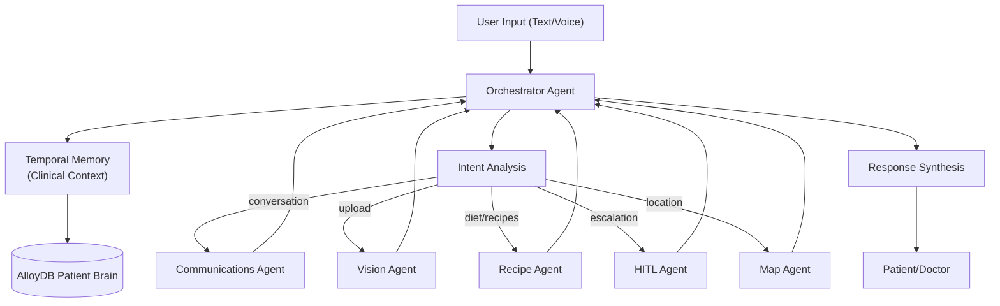

# Orchestrator Agent – Central Logic & Multi-Agent Coordination

> **Document**: `Cure-Quest/docs/orchestrator_agent.md`
> **Last updated**: 2026-05-01

---

## Goal

The **Orchestrator Agent** acts as the central brain of the Cure-Quest platform. Its primary goal is to analyze user intent (text/voice), maintain patient context, and delegate complex clinical or service-related tasks to specialist sub-agents (Vision, Diet, Map, etc.). It ensures that all patient interactions are grounded in the latest clinical data from the **AlloyDB Patient Brain**.

---

## Architecture Diagram



---

## Core Responsibilities

1. **Intent Routing**: Analyzes whether a request is a simple query, a medication update, a document upload, or an emergency.
2. **Context Management**: Injects relevant patient history (vitals, conditions, prescriptions) into every sub-agent request via the `TemporalMemory` agent.
3. **Action Drafting**: Coordinates with the `Questioner Agent` to seek explicit confirmation for sensitive actions (e.g., sending an email to a doctor or booking a calendar event).
4. **Service Integration**: Orchestrates tool calls to Google Workspace (Drive, Gmail, Calendar) and external APIs (openFDA, Google Maps).
5. **Human-in-the-Loop (HITL)**: Identifies critical symptom reports or prescription mismatches and triggers the `HITL Agent` for clinician review.

---

## Key Coordination Flows

| Target Agent | Coordination Logic |
|--------------|-------------------|
| **Vision Agent** | Triggered on `/document/pipeline` or image upload. Handles classification and extraction. |
| **Diet Agent** | Triggered for nutritional guidance, meal planning, or condition-aware recipes. |
| **Map Agent** | Triggered for pharmacy lookup, clinic routes, or geographic care navigation. |
| **HITL Agent** | Triggered when severity is "Severe/Critical" or when a patient requests a doctor handoff. |
| **Comms Agent** | Final layer for every response to ensure empathetic and clinically grounded language. |

---

## Agent Schema (Conversation Routing)

```python
class ConversationRoutingRequest(BaseModel):
    patient_id: int = Field(..., description="ID of the patient in AlloyDB")
    message: str = Field(..., description="User message (text or transcribed voice)")

class ConversationRoutingResponse(BaseModel):
    patient_id: int
    message: str
    reason: str | None = None
    execution_plan: list[str] = []
    action_id: int | None = None
    intent: str | None = None
    question: str | None = None
    options: list[dict] | None = None
```

---

## Validation & Implementation Status

- [x] **Database Connectivity**: Verified that Orchestrator connects to AlloyDB via `BrainGateway`.
- [x] **Intent Logic**: Verified `_maybe_draft_conversation_action` identifies doctor handoffs and email requests.
- [x] **Tool Execution**: Verified `_maybe_execute_conversation_tool` handles calendar booking and Drive listing.
- [x] **A2A Wiring**: Verified ADK orchestration layer routes calls to sub-agents (Vision, Map, etc.).
- [x] **Pydantic Validation**: All orchestration request/response models are strictly typed and validated.
- [x] **Error Handling**: Implemented structured error responses for failed tool executions (e.g., Gmail send failure).

---

## Testing Checklist

- [ ] `adk web src` → Root agent appears in agent dropdown
- [ ] Send query "I need to see a doctor" → Orchestrator triggers `Questioner` for draft action
- [ ] Send query "Check my health emails" → Orchestrator executes Gmail tool via `IntegrationsAgent`
- [ ] Confirm draft action → `PendingAction` table in AlloyDB is updated to `confirmed`
- [ ] Verify `TemporalMemory` correctly pulls last 3 prescriptions for context injection
- [ ] Stress test intent analysis with ambiguous medical queries
