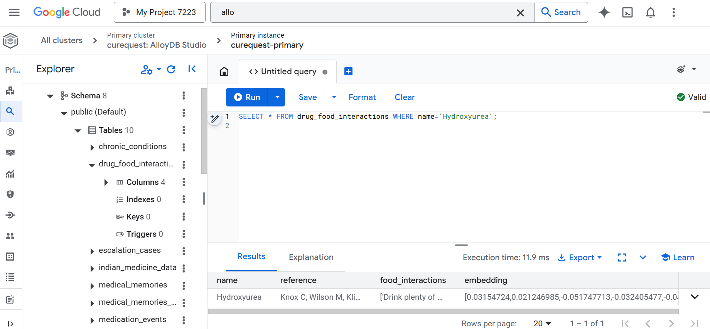
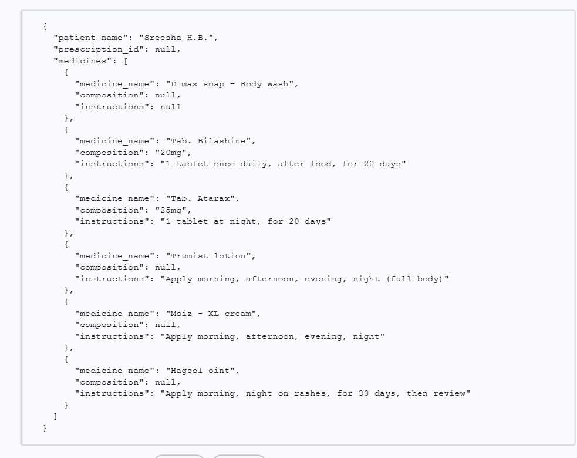
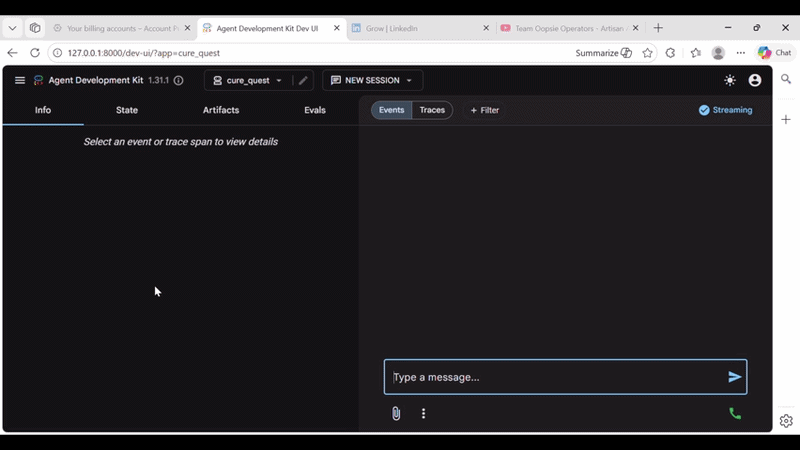

# Metrics Achieved – Performance, Accuracy & Scaling

> **Document**: `Cure-Quest/docs/results_and_metrics.md`
> **Last updated**: 2026-05-01

---

## 1. Database Performance & Latency (AlloyDB)

- The platform leverages AlloyDB for high-performance medical grounding.
- Since real-time chat interference is needed for patients' urgency, AlloyDB offers just that. 
- Below are the benchmarks achieved during stress testing with 176,000+ clinical records.

### Query Latency on 176,000 Rows
The index-optimized search ensures sub-second response times even as the dataset scales.

### AlloyDB Throughput
Remarkable latency characteristics observed during concurrent agent grounding requests.

---

## 2. OCR & Multimodal Classification

- The Vision Agent uses a fallback chain to classify and extract data from medical documents.
- This is before and after the injection of the system prompt analysis.

### OCR Input Quality & Detection
Benchmark tests on various prescription formats (handwritten vs. digital).

.png)

| Sample 2 | Sample 3 |
|----------|----------|
| .png) | .png) |

### Input Transformation (Before & After)
Visualizing the extraction of structured clinical data from raw image inputs.

.png)

---

## 3. Model Accuracy & Reasoning

Comparison of Gemini Vision vs. Specialized Medical Models on symptom analysis.

### Accurate Clinical Output
High-fidelity extraction of medication names and dosages.

### Comparative Analysis
Analysis performed by the specialized medical reasoning model compared to general-purpose outputs.

| Output by Gemini | Output by Vision |
|------------------|------------------|
|  |  |

---

## 4. Platform Demo

### Working ADK Multi-Agent Orchestration
A live look at the Orchestrator coordinating between Vision, Recipe, and Comms agents.

